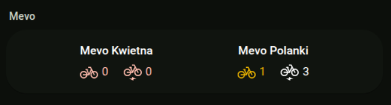

# Mevo Card

Lovelace card for the [ha-mevo](https://github.com/dulek/ha_mevo)
integration. Displays a compact row of badges with available bikes and
e-bikes for each Mevo station you monitor.



## Installation

### HACS

1. Add this repository to HACS as a custom repository (category:
   *Lovelace*).
2. Install **Mevo Card** via HACS.
3. Refresh the browser.

### Manual

1. Download `card.js` and place it in `<config>/www/mevo-card/`.
2. In **Settings → Dashboards → Resources**, add
   `/local/mevo-card/card.js` as a JavaScript module.

## Configuration

Add the card from the dashboard editor (search for *Mevo Card*) or
paste this into your dashboard YAML:

```yaml
type: custom:mevo-card
title: Mevo Stations
stations:
  - sensor.station_gda001
  - entity: sensor.station_gda002
    name: Plac Solidarności
```

### Options

| Option     | Type   | Default | Description                                             |
| ---------- | ------ | ------- | ------------------------------------------------------- |
| `title`    | string | _none_  | Header rendered at the top of the card.                 |
| `stations` | list   | _req._  | Stations to display.                                    |
| `extra`    | list   | _none_  | Extra indicators per badge: any of `docks`, `capacity`. |

Each entry under `stations` is either an entity ID string, or an
object with these fields:

| Option   | Type   | Default                                | Description                          |
| -------- | ------ | -------------------------------------- | ------------------------------------ |
| `entity` | string | _req._                                 | The Mevo sensor entity ID.           |
| `name`   | string | sensor's friendly name → entity ID     | Override the badge title.            |

The visual editor only sets the entity list — to use the `name`
override, edit the YAML directly.

The card reads `bikes_available` and `ebikes_available` from each
sensor's attributes. Counts of `0` are highlighted in the theme's
error color.

## Compatibility

Requires the [ha-mevo](https://github.com/dulek/ha_mevo) integration
(or any sensor exposing `bikes_available` / `ebikes_available`
attributes).

## Support

For issues or feature requests, open an issue on GitHub.
